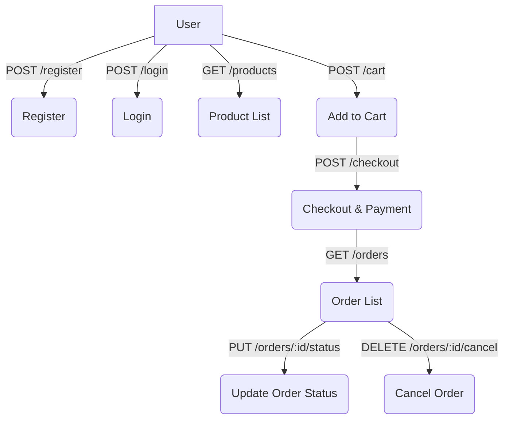
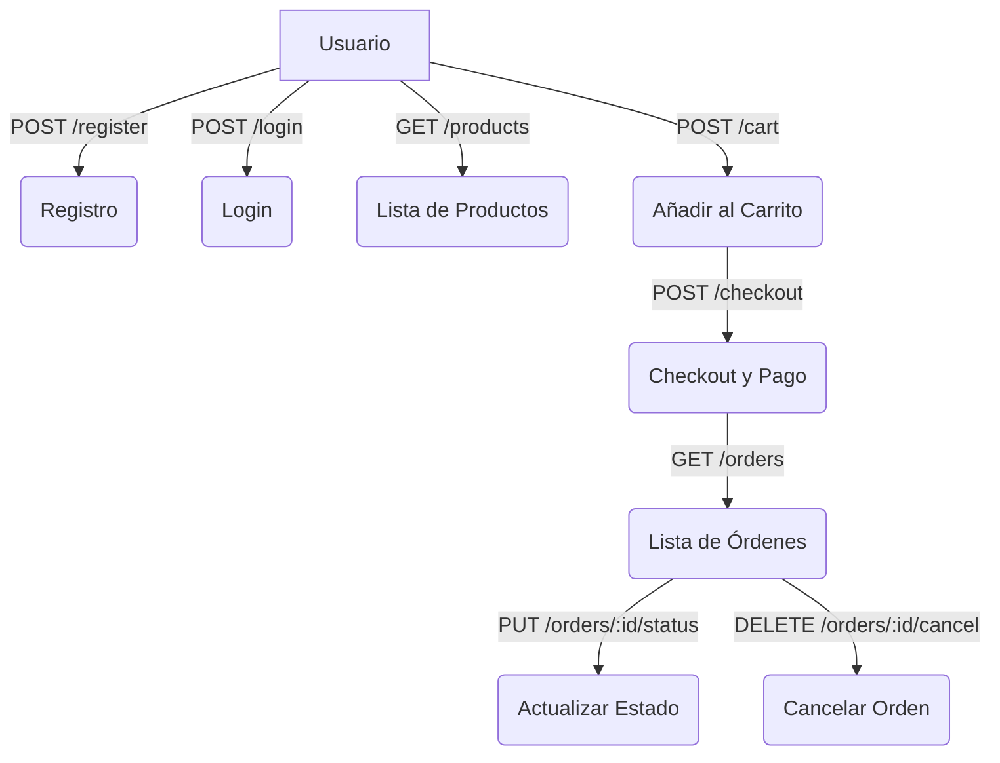

# E-Commerce API

## English

### Project Overview
A Node.js RESTful API for an e-commerce platform, supporting user authentication, product management, cart, orders, and Stripe payments. Built for learning and scalable real-world use.

### Tech Stack
- Node.js
- Express.js
- MongoDB (Mongoose)
- Handlebars (HBS)
- JWT (Authentication)
- Joi (Validation)
- Stripe (Payments)
- Jest & Supertest (Testing)

### Folder Structure
```
E-Comerce API/
├── src/
│   ├── controllers/
│   ├── models/
│   ├── routes/
│   ├── middlewares/
│   ├── app.js
│   └── ...
├── config/
├── public/
├── tests/
│   └── __mocks__/
├── package.json
├── .env
└── README.md
```

### Route Flow Diagram



## Endpoint Usage Examples

### Register
```
POST /register
{
  "name": "John Doe",
  "email": "john@example.com",
  "password": "Test1234!",
  "role": "user",
  "phoneNumber": "123456789"
}
Response: { "message": "User registered successfully", "token": "..." }
```

### Login
```
POST /login
{
  "email": "john@example.com",
  "password": "Test1234!"
}
Response: { "message": "Login successful", "token": "...", "user": { ... } }
```

### Get Products
```
GET /products
Response: [ { "_id": "...", "name": "Product 1", ... }, ... ]
```

### Add to Cart
```
POST /cart
{
  "productId": "...",
  "quantity": 2
}
Response: { "message": "Product added to cart successfully", "cart": { ... } }
```

### Checkout
```
POST /checkout
{
  "products": [ { "productId": "...", "quantity": 2 } ],
  "totalPrice": 100,
  "paymentMethodId": "pm_test_123"
}
Response: { "message": "Order and payment created successfully", "order": { ... }, "payment": { ... } }
```

### Get Orders
```
GET /orders
Response: [ { "_id": "...", "status": "completed", ... }, ... ]
```

### How to Run
1. Install dependencies: `npm install`
2. Set up `.env` with MongoDB, JWT, Stripe keys
3. Start: `npm start` or `npm run dev`
4. Run tests: `npm test` or `node --experimental-vm-modules node_modules/.bin/jest`

---

## Español

### Descripción del Proyecto
API RESTful en Node.js para una plataforma de e-commerce, con autenticación de usuarios, gestión de productos, carrito, órdenes y pagos con Stripe. Pensada para aprendizaje y uso profesional.

### Stack Tecnológico
- Node.js
- Express.js
- MongoDB (Mongoose)
- Handlebars (HBS)
- JWT (Autenticación)
- Joi (Validación)
- Stripe (Pagos)
- Jest & Supertest (Testing)

### Estructura de Carpetas
```
E-Comerce API/
├── src/
│   ├── controllers/
│   ├── models/
│   ├── routes/
│   ├── middlewares/
│   ├── app.js
│   └── ...
├── config/
├── public/
├── tests/
│   └── __mocks__/
├── package.json
├── .env
└── README.md
```

### Diagrama de Flujo de Rutas


## Endpoint Ejemplo de Uso

### Registro
```
POST /register
{
  "name": "Juan Pérez",
  "email": "juan@example.com",
  "password": "Test1234!",
  "role": "user",
  "phoneNumber": "123456789"
}
Respuesta: { "message": "User registered successfully", "token": "..." }
```

### Login
```
POST /login
{
  "email": "juan@example.com",
  "password": "Test1234!"
}
Respuesta: { "message": "Login successful", "token": "...", "user": { ... } }
```

### Obtener Productos
```
GET /products
Respuesta: [ { "_id": "...", "name": "Producto 1", ... }, ... ]
```

### Añadir al Carrito
```
POST /cart
{
  "productId": "...",
  "quantity": 2
}
Respuesta: { "message": "Product added to cart successfully", "cart": { ... } }
```

### Checkout
```
POST /checkout
{
  "products": [ { "productId": "...", "quantity": 2 } ],
  "totalPrice": 100,
  "paymentMethodId": "pm_test_123"
}
Respuesta: { "message": "Order and payment created successfully", "order": { ... }, "payment": { ... } }
```

### Obtener Órdenes
```
GET /orders
Respuesta: [ { "_id": "...", "status": "completed", ... }, ... ]
```

### Cómo Ejecutar
1. Instala dependencias: `npm install`
2. Configura `.env` con MongoDB, JWT y Stripe
3. Inicia: `npm start` o `npm run dev`
4. Ejecuta tests: `npm test` o `node --experimental-vm-modules node_modules/.bin/jest`
